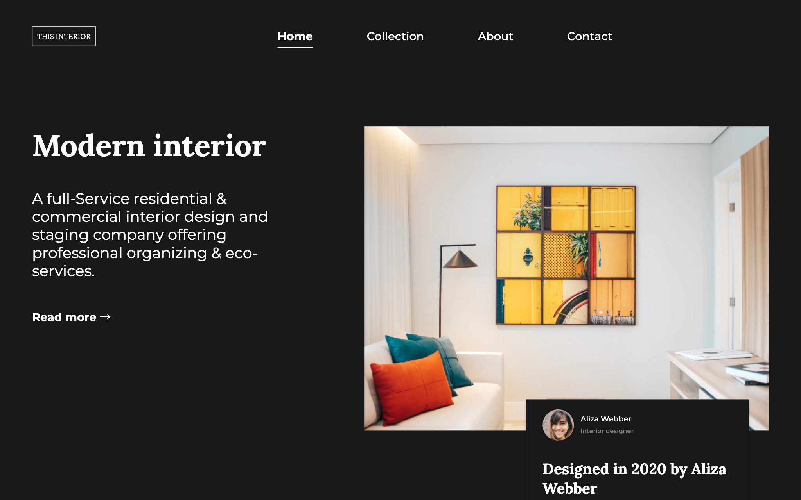
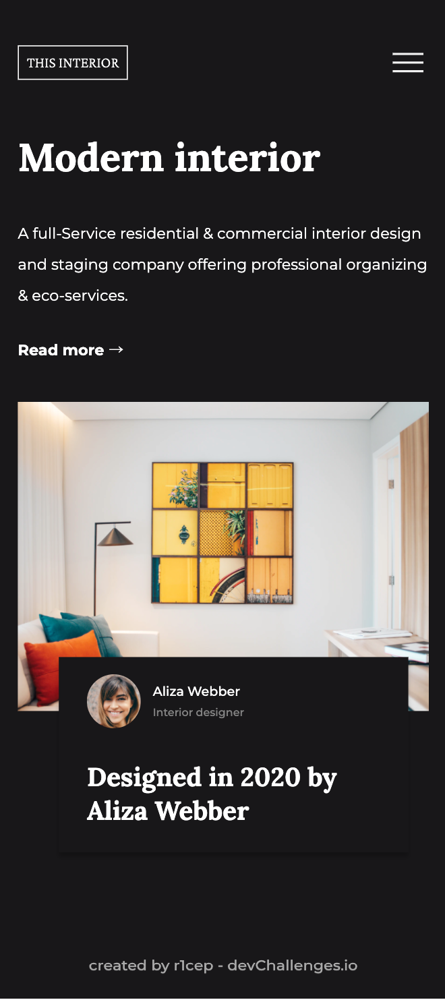

<!-- Please update value in the {}  -->

<h1 align="center">Interior Consultant</h1>

   Solution for a challenge from  <a href="http://devchallenges.io" target="_blank">Devchallenges.io</a>.

  <h3>
    <a href="https://r1cep.github.io/dev-challenges-interior-consultant/">
      Demo
    </a>
     | 
    <a href="https://github.com/r1cep/dev-challenges-interior-consultant">
      Solution
    </a>
     | 
    <a href="https://devchallenges.io/challenges/Jymh2b2FyebRTUljkNcb">
      Challenge
    </a>
  </h3>

<!-- TABLE OF CONTENTS -->

## Table of Contents

- [Table of Contents](#table-of-contents)
- [Overview](#overview)
  - [Desktop](#desktop)
  - [Mobile](#mobile)
  - [Drawer navigation](#drawer-navigation)
  - [Built With](#built-with)
- [Features](#features)
- [learned/improved](#learnedimproved)
- [Acknowledgements](#acknowledgements)
- [Contact](#contact)

<!-- OVERVIEW -->

## Overview

### Desktop

### Mobile

### Drawer navigation

### Built With

<!-- This section should list any major frameworks that you built your project using. Here are a few examples.-->

- [HTML: HyperText Markup Language | MDN](https://developer.mozilla.org/ja/docs/Web/HTML)
- [CSS: カスケーディングスタイルシート | MDN](https://developer.mozilla.org/ja/docs/Web/CSS)
- [Node.js](https://nodejs.org/ja/): 18.7.0
- [Vite | 次世代フロントエンドツール](https://ja.vitejs.dev/): 3.0.7

## Features

<!-- List the features of your application or follow the template. Don't share the figma file here :) -->

This application/site was created as a submission to a [DevChallenges](https://devchallenges.io/challenges) challenge. The [challenge](https://devchallenges.io/challenges/Jymh2b2FyebRTUljkNcb) was to build an application to complete the given user stories.

> - User story: I can see a page following the given design
> 
> - User story: On mobile, I can see a collapsed navigation
>
> - User story: On mobile, when I select the hamburger menu, I can see a navigation

## learned/improved

- Underline animation method on hover
- How to implement a drawer menu
- Animation of hamburger menu

## Acknowledgements

<!-- This section should list any articles or add-ons/plugins that helps you to complete the project. This is optional but it will help you in the future. For exmpale -->

- [CSS：ホバー時のアンダーラインアニメーションの実装サンプルとmixinを用いた実装方法 - NxWorld](https://www.nxworld.net/css-hover-underline-animation-examples-and-sass-mixin.html)

## Contact

- GitHub [@r1cep](https://github.com/r1cep)
